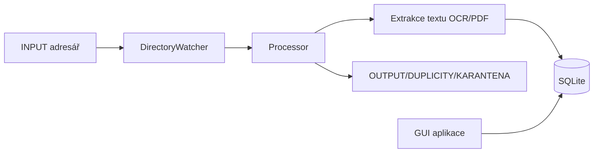

# Architektura KájovoSpend

## Přehled modulů
- `service_main.py`: běh služby (watcher, fronta úloh, control endpoint).
- `run_gui.py` + `src/kajovospend/ui/`: desktop GUI (PySide6) pro import, kontrolu a reporting.
- `src/kajovospend/service/`: orchestrace importu, zpracování OCR/PDF a přesunů souborů.
- `src/kajovospend/extract/`: extrakce polí z OCR textu a strukturovaných PDF.
- `src/kajovospend/db/`: SQLAlchemy modely, migrace a dotazy.
- `src/kajovospend/integrations/`: externí integrace (ARES, OpenAI fallback).

## Datový tok

## Bezpečnostní rozhodnutí
- Síťové timeouty jsou explicitní pro HTTP volání (`requests`).
- YAML konfigurace používá `yaml.safe_load`.
- Přesuny souborů používají bezpečný fallback `copy2 + unlink` při locku.

## Diagramy
- [System context](diagrams/system-context.mmd)
- [Main flow](diagrams/main-flow.mmd)
- [Key sequence](diagrams/key-sequence.mmd)
- [Components](diagrams/components.mmd)
