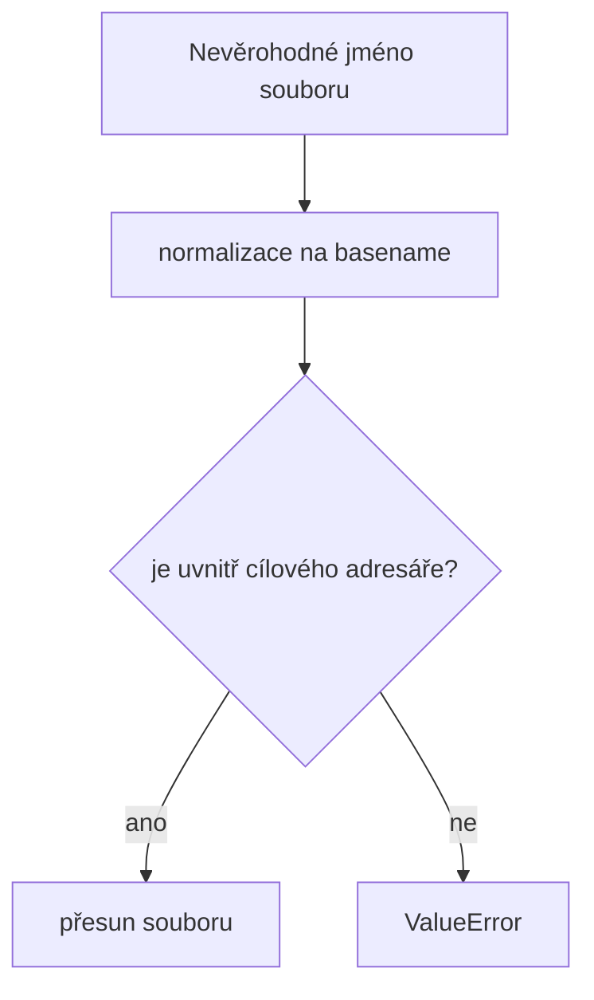

# Security – KájovoSpend

## Threat model
### Assets
- účetní doklady (PDF/obrázky)
- metadata v SQLite (IČO, částky, datumy)
- konfigurační soubory (`config.yaml`)

### Entrypointy
- filesystem watcher (`paths.input_dir`)
- GUI akce uživatele
- HTTP integrace (ARES, volitelně OpenAI)

### Trust boundaries
- lokální souborový systém vs. externí API
- interní zpracování OCR vs. nespolehlivá vstupní data z dokumentů

## Bezpečnostní pravidla
- žádné `yaml.load` bez safe loaderu
- žádné `eval` / `exec` pro vstupní data
- HTTP volání musí mít timeout
- logy nesmí obsahovat citlivé tokeny

## Secrets
- API klíče patří do `.env` nebo lokálního `config.yaml` mimo verzování
- nikdy necommitovat PAT/API klíče do repozitáře

## Dependency policy
- pinovat verze v `requirements.txt`
- při update ověřit kompatibilitu s Python 3.11–3.13

## Nově pokrytá rizika (audit 2026-02)
- **Path traversal při přesunu souborů**: cílové jméno souboru se normalizuje na basename, takže vstupy typu `../../x` nebo `sub\x` nemohou opustit cílový adresář.
- **Regresní testy**: přidané unit testy ověřují sanitizaci názvu i sjednocení Windows oddělovačů.

